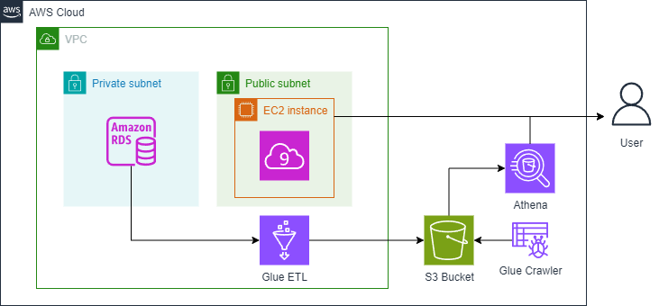

# Data Pipeline for Sales Analysis using AWS Services

*Project Overview*

This project implements a complete data pipeline for a retail company, showcasing the entire Data Engineering Lifecycle. The pipeline extracts data from a MySQL database hosted on Amazon RDS, transforms it for better analytics, and loads it into Amazon S3 for storage. Finally, Amazon Athena allows querying the processed data and creating visualizations with Jupyter Lab. Terraform is used to manage and provision the infrastructure as code (IaC).

*Introduction*

The retailer stores historical sales and customer data in a relational database. The goal is to create a data pipeline that simplifies data access and improves performance for analytics. This project uses the classic MySQL sample database and transforms it into a star schema format to support efficient querying.

This project demonstrates a complete data pipeline using AWS services and showcases all stages of the data engineering lifecycle. The pipeline extracts data from a relational database in Amazon RDS (MySQL), processes it with AWS Glue, and stores the transformed data in Amazon S3. It then leverages Amazon Athena to query and analyze the data, visualizing the results in Jupyter Lab. All the infrastructure components are managed and deployed using Terraform as Infrastructure as Code (IaC).

## Project Overview

The retailer company in this project sells scale models of classic cars and stores its historical purchases and customer data in a relational database. The marketing team wants to analyze the historical sales data, but complex analytical queries on the production database can be slow and impact its performance.

### Goal

As a Data Engineer, your goal is to build a data pipeline that extracts, transforms, and loads (ETL) the data into a more accessible format, enabling the marketing team to analyze it efficiently without impacting the source system.

## Architecture

### Pipeline Components

1. *Source Database*: A MySQL database hosted on Amazon RDS. It contains the following tables: customers, products, productlines, orders, orderdetails, payments, employees, offices.
2. *ETL with AWS Glue*:
   - *Extraction*: Data is extracted from the source RDS MySQL database.
   - *Transformation*: The extracted data is transformed into a star schema for better query efficiency and readability.
   - *Load*: Transformed data is stored in Amazon S3 in Parquet format.
3. *Serving Layer with Amazon Athena*: Athena is used to query the stored data, providing the marketing team with SQL-like access without additional database loads.

### Architecture Diagram




*Exploring the Source System*

Before building the pipeline, we'll explore the source database hosted on Amazon RDS. Steps include:

1. *Retrieving the Endpoint:* Use the AWS CLI to get the endpoint of the MySQL RDS instance.
2. *Connecting and Inspecting:* Connect to the database using the retrieved endpoint, username, and password. Explore the tables and sample data.

*Architecture of the Data Pipeline*

The pipeline consists of three main components:

  * *Source Database:* MySQL database on Amazon RDS.
  * *ETL with AWS Glue:*
      * *Extraction:* Data is extracted from the source RDS MySQL database.
      * *Transformation:* The extracted data is transformed into a star schema for better query efficiency and readability.
      * *Load:* Transformed data is stored in Amazon S3 in Parquet format.
  * *Serving Layer with Amazon Athena:* Athena allows querying the stored data using SQL-like access, facilitating analysis without additional database load.

*Step-by-Step Workflow*

1. *Setting Up the Source System:* Connect to the pre-configured MySQL instance on RDS to explore its tables and data structure.

2. *Building the Data Pipeline with Terraform:* Terraform automates the creation of AWS resources.

    * Initialize Terraform: terraform init
    * Generate a Plan: terraform plan
    * Apply the Plan: terraform apply

    Terraform provisions resources like S3 bucket, RDS instance, and Glue job.

3. *Running the ETL Job with AWS Glue:* After deploying the infrastructure, start the Glue job:

    * Start Glue Job: aws glue start-job-run --job-name <job-name> | jq -r '.JobRunId'
    * Check Job Status: aws glue get-job-run --job-name <job-name> --run-id <JobRunID> --output text --query "JobRun.JobRunState"

    The Glue job performs data extraction, transformation to star schema, and loads the data into S3.

4. *Querying with Amazon Athena:* Athena allows querying the transformed data stored in S3, providing analysts easy access for analysis.

*Technologies Used*

* Amazon RDS (MySQL): Stores the source data.
* AWS Glue: Performs ETL operations.
* Amazon S3: Stores the transformed data in Parquet format.
* Amazon Athena: Allows querying the transformed data using SQL.
* Terraform: Manages and deploys the infrastructure as code.

*Prerequisites*

* Basic knowledge of AWS services (RDS, Glue, S3, Athena).
* Experience with Terraform and its configuration files.
* Familiarity with MySQL and SQL syntax.


## Directory Structure

The following directory structure is used in this project to organize the files and resources effectively:

```bash
.
├── data
│   └── mysqlsampledatabase.sql   # SQL script to populate the MySQL database
├── images
│   ├── ETL.drawio.png            # Architecture diagram
│   ├── schema_after_ETL.png      # Star schema after transformation
│   └── show_tables.png           # Screenshot of MySQL tables
├── infrastructure
│   ├── terraform
│   │   ├── main.tf               # Main Terraform configuration file
│   │   ├── variables.tf          # Terraform variables
│   │   ├── outputs.tf            # Terraform outputs
│   │   └── assets
│   │       └── glue_job.py       # Glue job Python script
├── README.md                     # Project documentation

```

## Conclusion
* This project demonstrates a complete data pipeline built with AWS services for sales analysis. The pipeline extracts data from a MySQL database, transforms it for efficient querying, and stores it in S3 for easy access. Terraform manages the infrastructure as code, ensuring a repeatable and automated deployment process. Let us know if you have any questions! *
